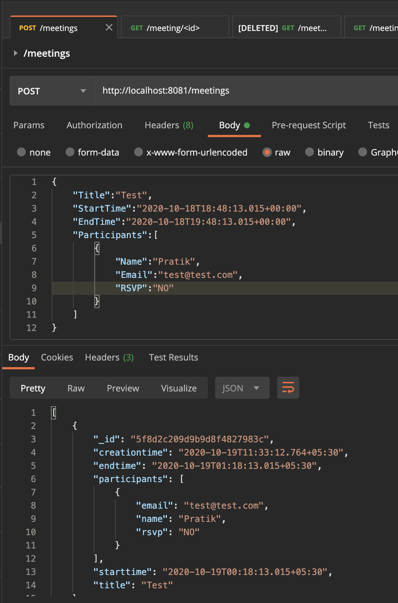
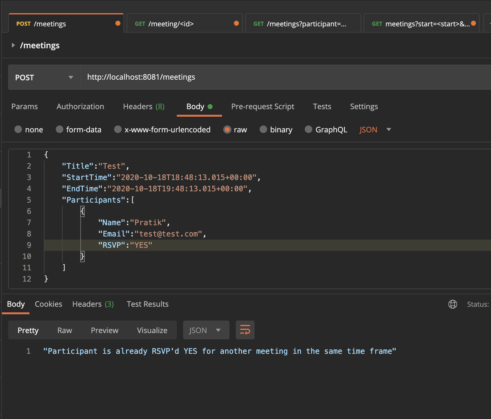
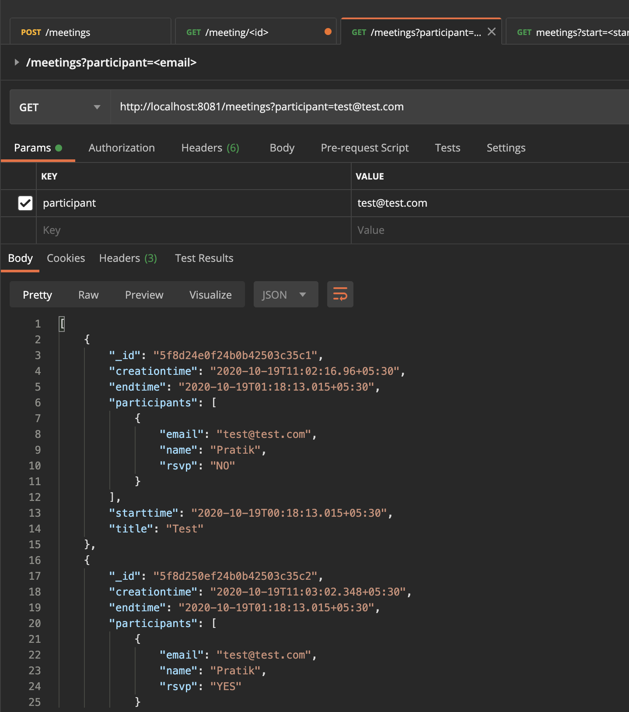
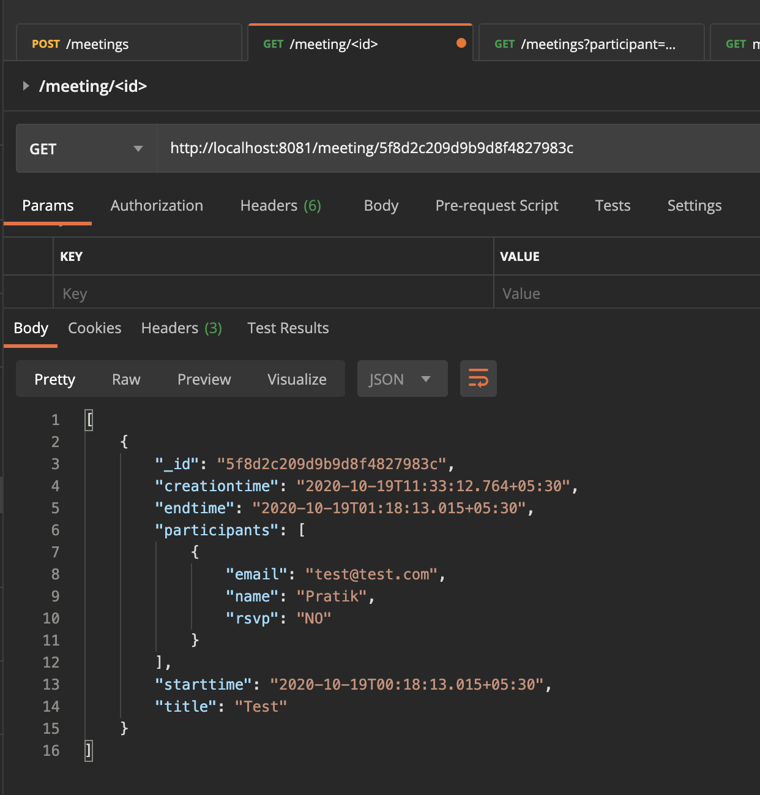
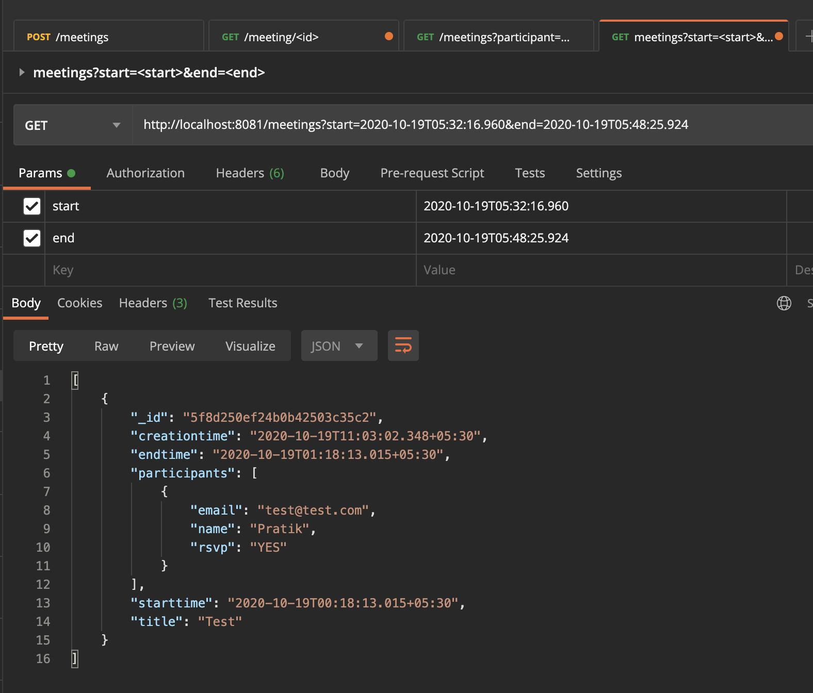

# Meeting API

## Usage

1. Clone the repository from GitHub:

```bash
git clone https://github.com/pratikbaid3/Appointy_Go_Test
```

2. Navigate to project's root directory:

```bash
cd ppointy_Go_Test
```

3. Run the app:

```bash
go run main.go
```

## End Points

### 1. Creating A New Meeting (POST)(Success)
```bash
http://localhost:8081/meetings
```



### 2. Creating A New Meeting (POST)(Fail due to participant duplication)
```bash
http://localhost:8081/meetings
```



### 3. Get Meeting By Participant Email (GET)
```bash
http://localhost:8081/meetings?participant=test@test.com
```



### 4. Get Meeting By Meeting Id (GET)
```bash
http://localhost:8081/meeting/5f8d2c209d9b9d8f4827983c
```



### 5. Get Meeting By Time Frame (GET)
```bash
http://localhost:8081/meetings?start=2020-10-19T05:32:16.960&end=2020-10-19T05:48:25.924
```


## Contributing Convention

```
feat: New features added

fix: Bugs fixed

test: Everything related to testing

docs: Everything related to documentation

refactor: Regular code refactoring and maintenance
```
